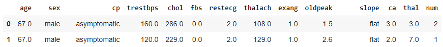
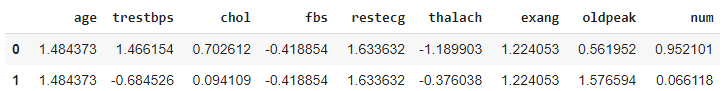
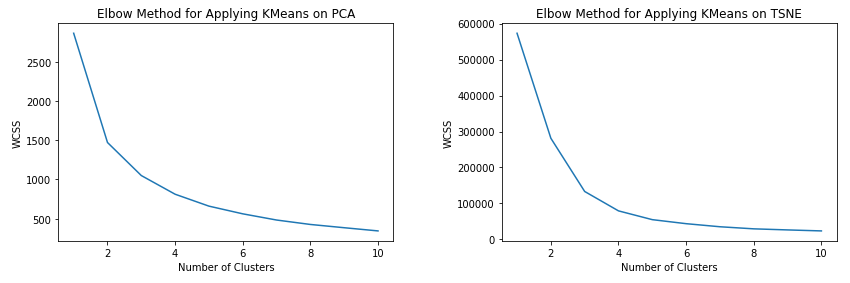
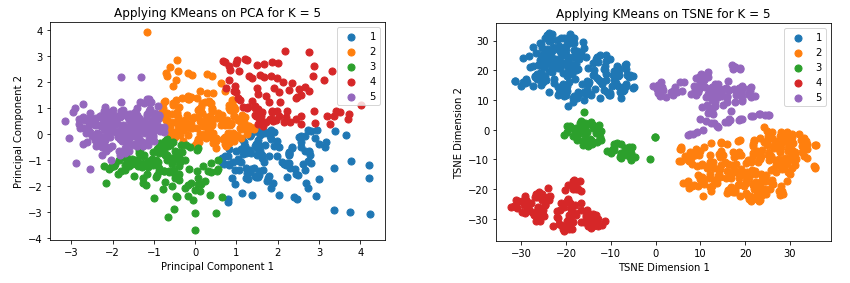
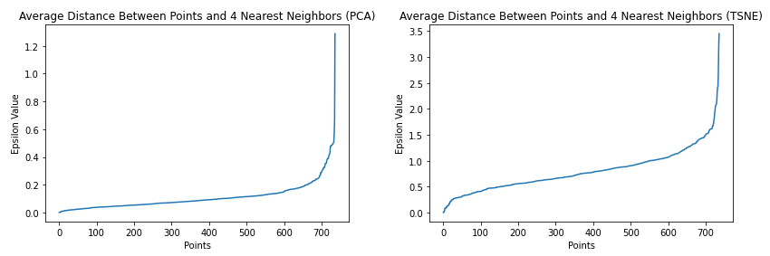
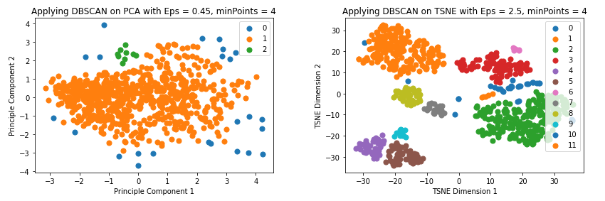
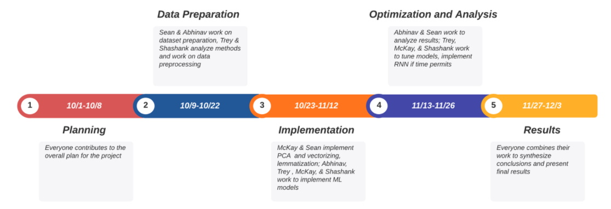

# Machine Learning for Healthcare

### Check out our [Proposal Video](https://www.youtube.com/watch?v=RcSERS1OwWU)! 

## Project Proposal 

### Unsupervised Machine Learning to Investigate Cardiovascular Disease

#### Introduction and Background
Cardiovascular disease is one of the leading causes of death in the United States. Development of cardiovascular disease has been correlated with risk factors including obesity, high cholesterol, and hypertension [1]. Most of these risk factors are preventable with proper patient education.

#### Problem Definition
Identifying specific clinical sub-populations of patients with cardiovascular disease can help researchers develop more personalized treatments and help doctors better predict specific types of patients that will be at risk for developing heart disease.

#### Data Collection
##### About the Dataset
We conducted the following analysis using the Heart Disease Dataset made publicly available through the University of California, Irvine’s Machine Learning Repository [5]. It includes data collected from patients treated by the Hungarian Institute of Cardiology, the University Hospitals in Zurich and Basel, Switzerland, the Long Beach Veterans Affairs Medical Center, and the Cleveland Clinic Foundation. 

The published dataset is a subset of the original dataset, which contains fourteen features related to the patients’ sociodemographics and cardiovascular health. The published dataset was processed to account for any missing or corrupted data and anonymizes the records.


##### Data Cleaning

Data cleaning involved taking the raw data files and loading them into data frames, then applying categorical labels where appropriate. We then remove categorical features, as we are currently interested in applying clustering methods to numerical data. We measure the frequency of missing data for each feature, and eliminate those that are missing greater than 20% of the data. This was based on analyzing the frequencies. Most features had over 90% valid data whereas a few had less than 50%. In the interest of balancing the number of features with the amount of eliminated rows, 80% was chosen. We also  eliminate rows which are missing features. This process is done to maximize the number of valid data points available. 

Before the final report, we plan to use interpolation methods to reduce the amount of eliminated data.


#### Methods
Unsupervised machine learning techniques offer a solution for organizing patients into sub-populations based on their medical history. A previous study has proven clustering algorithms to be successful in identifying clinical sub-populations of Alzheimer’s disease patients [2]. A similar exploratory method will be applied to study patients with cardiovascular disease. T-Stochastic Neighbor Embedding and Principal Component Analysis will be applied to produce independent dimensionally-reduced versions of the original dataset. K-Means and DBSCAN clustering algorithms will then be separably applied to the original dataset and the reduced dimensionality versions of the dataset. The analysis which produces the most separable clusters will be selected for further statistical analysis to determine the characterizing features of each cluster.

##### Dimensionality Reduction

We use dimensionality reduction for two reasons:
Visualize the features
Simplify our conclusions

We independently use two methods of dimensionality reduction: **PCA** and **t-SNE**

**PCA**
We utilize Principal Component Analysis (PCA) to reduce our data to two dimensions, corresponding with our first two principal components. PCA finds an orthogonal basis for the datasets, with the spanning vectors in order of the directions of most variance. 

We chose this method since after normalizing each parameter (eg. subtracting the mean and dividing by the standard deviation), features in heart disease dataset with high variance are hypothesized to have high meaning (age, cholesterol).

Figure XXX below shows the two components selected. Both have quite high variance, and principal component 1 has slightly more variance than component 2. This similarity could suggest that more than 2 components will be useful.

**t-SNE**
We utilize t-distributed stochastic neighbor embedding to reduce the data into two dimensions.

## Unsupervised Learning

We independently use two clustering methods on the two dimension-reduced data sets: K-means and DBSCAN.
## K-means

We then apply K-means clustering to both the PCA, t-SNE, and non-reduced points. By plotting the Within-Cluster Sum of Square (WCSS) against the number of clusters, we obtain the following results. 
Using the elbow method (i.e. selecting the point on the curve where the slope changes from greater than 1 to less than 1, or vise versa), we find the most effective number of clusters for each set of points.

For t-SNE, the ideal number of clusters is K=5. For PCA, the ideal number of clusters is also K=5.

We then apply DBSCAN to both PCA, t-SNE, and non-reduced points. By plotting the epsilon value against the average distance between points and their 4 nearest neighbors, we obtain the ideal epsilon values for each.

For PCA, we find the ideal epsilon value to be around… [need to recompute]

For t-SNE, we find the ideal epsilon value to be around…


#### Results and Discussion
The discovered clinical sub-populations will be presented along with their characterizing features. A review of medical literature will be conducted to contextualize these results with previous findings concerning cardiac disease.

To evaluate the quality of our clustering methods, we use **Silhouette Coefficient**. The Silhouette Coefficient is a value from -1 to 1, where 1 represents tightly packed clusters far apart and -1 represents random data with random labels. Typically, clustering results with negative numbers are considered largely meaningless.

### Our three clutter results have the following Silhouette Coefficients (S):

KMeans on TSNE for K = 5
S = 0.574

DBSCAN on PCA with Eps 0.45, minPoints = 4
S = 0.114

DBSCAN on TSNE with Eps 2.5, minPoints = 4
S = 0.342

These results that KMeans, despite its rudimentary approach, achieves the quantifiably best clusters. It should be noted, however, that after using t-SNE, the distance between well-separated clusters is not very meaningful. Therefore, Silhouette Coefficient on TSNE results must be taken with a grain of salt, since this metric is quite sensitive to cluster separation distance. Qualitatively, the figures above show that the two clustering methods with high Silhouette Coefficients do appear to have the best clustering.

In the next phase of our project, we will assess the quality of our clusters using the features themselves. If our goal is to make meaningful groups of heart disease patients, how meaningful are the clusters?

We’ll answer this question by looking at the distributions of the original features within each cluster. We aim to contextualize each cluster with existing conditions in order to see if the cluster detects an existing type of patient or suggests a novel type of heart condition.


- Explain the data cleaning process
- Data Preprocessing - PCA and feature selection
- Supervised/unsupervised method used - KMeans/DBScan 
- Analysis using metrics
<p align="center">
  
</p>
<p align="center">
  
</p>
<p align="center">
  
</p>
<p align="center">
  
</p>
<p align="center">
  
</p>
<p align="center">
  
</p>

### Supervised Machine Learning to Detect and Classify Anti-Vaccine Tweets 

#### Introduction/Background
The ongoing pandemic has yielded not only various vaccines, but also a plethora of anti-vaccination messages and posts all over the internet. The prevalence of anti-vaccine content has propagated a spread of health information across social media platforms. The spreading of false anti-vaccine information on a large scale has the potential to put human lives at risk. 

#### Problem Fefinition: 
Autonomously detecting tweets with anti-vaccine content can help authorities efficiently find published messages on Twitter that may be spreading incorrect false information about vaccines.

#### Data Collection
We use the publicly available Avax Tweets Dataset [4] which contains around 4 million tweets scraped from Twitter. These tweets were scraped based on particular keywords related to anti-vaccination and vaccine hesitancy. Apart from the text of the tweet, the data also consists of supplemental information such as number of hashtags, the number of mentions etc. There are over 20 fields for each tweet. We downloaded this dataset and wrote a simple script to extract all the `json` files from each compressed file and choose 6 meaningful features manually which will help us in classification, while discarding the rest. We further preprocess this data, as explained in the Results section. 

#### Methods:
Previous work has proven that supervised machine learning methods are a viable solution for detecting anti-vaccine tweets [3]. Similar methods will be utilized to train a classifier to detect anti-vaccine tweets based upon the Avax Tweet dataset [4]. Normalization techniques including transforming text to lowercase, removing unneeded characters, and lemmatization will be applied to prepare the dataset for processing. The preprocessed data will be partitioned into separate datasets for training and testing purposes. A Support Vector Machine model and a Naive Bayes model will be independently tested as the classifier for the project. The performance of each classifier will be analyzed by considering metrics such as F1 scores.

#### Results and Discussion: 
The performance metrics for each model will be presented and compared with previous studies [3] to determine the efficacy of each model.

##### Data Cleaning and Preprocessing
Our final goal is to train a Machine Learning classifier on our tweets. In order to do this, we need to convert the text of all tweets to robust vector representations, which will be fed as input to our ML models. Hence, it is essential to clean the text of our data before we convert the sentences into vectors. Tweets can be really messy; for instance, one of the tweets in our dataset is: 

```
@Oktoba1 @shapulem @Bongagatshen Oh shit*t I saw it and have always known about Bill Gates depopulation. That man is nuts
```

We can see this text is extremely messy with various user mentions, hashtags and lots of stopwords (I, it, is etc.). We wish to extract words from this tweet that actually contain information about the tweet and discard the rest. We carry out a systematic and an efficient data cleaning and preprocessing pipeline as explained below: 

- All the data is first converted to lower case.
- All punctuation marks are removed from the text, which is why we don't notice any commas or full stops in the processed text. 
- The stop words are removed from the text. 
- We then convert numbers to their corresponding textual form, like "one" to "1". 
- Removing User Mentions from the tweets. 
- Performing word segmentation of the hashtags, for instance, #KillBillGates converts to `['kill', 'bill', 'gates']`
- Elimination of webpage URL's from the text, such as `https://tinyurl/45hfhejwn5`

After processing, the tweet above is converted into the following form: 

```
'oh shit saw alway known bill gate depopul man', 'nut'
```
And voila! We have our tweet cleaned up, devoid of any unnecessary hashtags and user mentions and consisting of words that are actually representative of the information the tweet wishes to convey. Now that our data has been cleaned, we have one more step left in the preprocessing - generating the vector representations. 

For converting our preprocessed tweets to vectors, we use the popular `Word2Vec` model and generate a 96 dimensional vector for each word in the tweet. For this purpose, we convert each sentence into ints constituent words. For our example above, we obtain the following `list_of_words`. 

```
['oh',
 'shit',
 'saw',
 'alway',
 'known',
 'bill',
 'gate',
 'depopul',
 'man',
 'nut']
```
We do this for all the words in the tweet and average them out to generate a *single* 96-dimensional vector for each tweet. For the above tweet, we obtain the following vector (96 dimensions!)
```
array([ 5.37666000e-04,  5.18207796e-04, -1.12039914e-04,  1.05319139e-03,
        1.75804401e-04,  6.02923421e-05,  5.01881624e-04, -2.36704507e-04,
        1.40517872e-03, -1.06460932e-03,  1.30764327e-03,  1.15759881e-03,
        1.97241021e-03, -1.32080975e-03, -2.53068808e-04, -1.12961288e-04,
       -9.72209359e-04, -2.07749269e-04,  2.99530548e-04,  2.59809106e-04,
        6.63112437e-04,  1.07209225e-04,  4.32135538e-04, -2.34051836e-04,
       -1.50410832e-03, -1.23404741e-03,  1.40412878e-03, -1.64668173e-04,
        7.00455781e-04, -5.04640365e-04,  9.10372999e-05,  2.98709702e-04,
       -4.16984065e-04, -8.42609823e-04, -2.46841389e-04,  1.72498414e-05,
        4.52818043e-04, -7.78393005e-04,  1.01294615e-04, -3.39327552e-04,
        1.74363914e-03,  7.47963965e-06, -1.20861938e-03,  7.92024044e-04,
        2.15746982e-04, -3.44382466e-04,  1.31812609e-03, -1.03099750e-03,
        7.97298401e-04, -1.20819975e-03, -3.34248556e-04, -2.23026774e-04,
       -1.38816406e-04,  8.12595978e-04, -3.76687627e-04, -5.56226408e-04,
        6.67217565e-04, -1.29970188e-03,  4.32334312e-04, -2.00047430e-04,
        1.24685379e-03,  1.16194182e-03,  2.29074249e-03,  1.61270315e-04,
       -1.91903434e-03,  7.32190079e-04, -4.03655496e-04,  4.84672382e-04,
        4.30977417e-04, -8.66198744e-04, -4.91266667e-04,  1.90914217e-03,
       -6.29564613e-05,  1.15709208e-03,  9.10942640e-05, -4.04445784e-04,
       -2.16572447e-04,  3.62433939e-04,  4.21591372e-05, -1.25255896e-03,
        5.54569258e-04, -1.44953500e-04, -4.64453746e-04, -1.20326734e-04,
       -8.27332081e-05, -4.15258794e-04, -1.43937394e-03,  5.20161183e-04,
        6.71408542e-04,  1.23154560e-05,  5.22322713e-04, -6.71783066e-04,
       -4.87862376e-04,  4.53212174e-04,  5.04155482e-04,  9.52582094e-04])
```

- Supervised/unsupervised method used - KMeans/DBScan 
- Analysis using metrics

#### Citations
[1] Tran, D.-M. T., Lekhak, N., Gutierrez, K., & Moonie, S. (2021). Risk Factors Associated with Cardiovascular Disease Among Adult Nevadans. *PLOS ONE, 16*(2). https://doi.org/10.1371/journal.pone.0247105 

[2] Prakash, J., Wang, V., Quinn, R. E., & Mitchell, C. S. (2021). Unsupervised Machine Learning to Identify Separable Clinical Alzheimer’s Disease Sub-Populations. *Brain Sciences, 11*(8), 977. https://doi.org/10.3390/brainsci11080977 

[3] To, Q. G., To, K. G., Huynh, V.-A. N., Nguyen, N. T., Ngo, D. T., Alley, S. J., Tran, A. N., Tran, A. N., Pham, N. T., Bui, T. X., & Vandelanotte, C. (2021). Applying Machine Learning to Identify Anti-Vaccination Tweets During the Covid-19 Pandemic. *International Journal of Environmental Research and Public Health, 18*(8), 4069. https://doi.org/10.3390/ijerph18084069 

[4] Muric, G., Wu, Y., & Ferrara, E. (2021). COVID-19 Vaccine Hesitancy on Social Media: Building a Public Twitter Dataset of Anti-Vaccine Content, Vaccine Misinformation and Conspiracies. https://doi.org/10.2196/preprints.30642 

[5] Janosi, A., Steinbrunn, W., Pfisterer, M., & Detrano, R. (1988). Heart Disease Data Set [Data set]. https://archive.ics.uci.edu/ml/datasets/heart+Disease


#### Proposed Project Timeline

<p align="center">
  
</p>

| Week                      | Milestone we hope to accomplish                          | Primary Responsibilities |
| ------------------------- | -------------------------------------------------------- | -------------------------|
| Week 7: Oct 1 to Oct 8    | Brainstorm on ideas and write the Project Proposal       | Everyone!                |
| Week 8: Oct 9 to Oct 15   | Dataset Preparation for both tasks                       | Sean and Abhinav
| Week 9: Oct 16 to Oct 22  | Analysing supervised and unsupervised methods and data preprocessing | Trey and Shashank 
| Week 10: Oct 23 to Oct 29 | Implementing PCA (unsupervised) and vectorizing/lemmatization (supervised) | McKay and Sean
| Week 11: Oct 30 to Nov 05 | Implement the ML models - KMeans for unsupervised and Naive Bayes for supervised and obtain results | Abhinav and Trey
| Week 12: Nov 06 to Nov 12 | Implement the ML models - DBSCAN for unsupervised and SVM for supervised and obtain results | McKay and Shashank
| Week 13: Nov 13 to Nov 19 | Analyse all results using performance and evaluation metrics | Abhinav and Sean
| Week 14: Nov 20 to Nov 26 | Further testing and feedback. Attempting to improve model accuracies. Implementing the RNN for the supervised taks (if time permits). | Trey, McKay and Shashank
| Week 15: Nov 27 to Dec 03 | Work on the Final Presentation! | Everyone!


