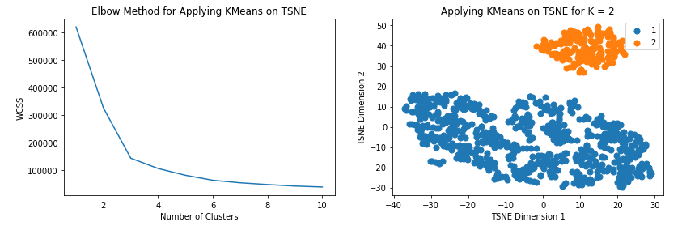
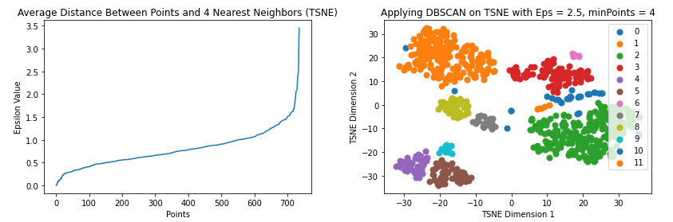

# Machine Learning for Healthcare

### Check out our [Proposal Video](https://www.youtube.com/watch?v=RcSERS1OwWU)! 

### Check out our [Final Presentation Video](https://youtu.be/8tKC5c4EVPk)! 

## Project Final Report

### Unsupervised Machine Learning to Investigate Cardiovascular Disease

#### Introduction and Background
Cardiovascular disease is one of the leading causes of death in the United States. Development of cardiovascular disease has been correlated with risk factors including obesity, high cholesterol, and hypertension [1]. Most of these risk factors are preventable with proper patient education.

Clustering heart-disease datasets has yielded meaningful subpopulations. Wilson et al. performed clustering on risk factors and found a large correlation between weight and heart disease risk [7]. Twisk et al. observed clusters forming round three measurable body metrics: total-cholesterol-to-HDL ratio, sum of skin folds, and cardiopulmonary fitness (VO2-max) [8]. Singh and Rajesh combined a K-means algorithm with logistic regression to predict heart disease based on several features identified as important by K-means. [9]

#### Problem Definition
Identifying specific clinical subpopulations of patients with cardiovascular disease can help researchers develop more personalized treatments and help doctors better predict specific types of patients that will be at risk for developing heart disease.

Our work adds to the body of research described. We set out to confirm the previous results and contribute some additional clusters for consideration to this field.

#### Data Collection
##### About the Dataset
We conducted the following analysis using the Heart Disease Dataset [5] made publicly available through the University of California, Irvine’s Machine Learning Repository [6]. It includes data collected from patients treated by the Hungarian Institute of Cardiology, the University Hospitals in Zurich and Basel, Switzerland, the Long Beach Veterans Affairs Medical Center, and the Cleveland Clinic Foundation. 

The published dataset also provides commonly used subsets of the original dataset, which contain fourteen features related to the patients’ sociodemographics and cardiovascular health. The published dataset was processed to account for any missing or corrupted data and anonymizes the records. Figure 1 provides a sample from this dataset.

<p align="center">
  
  <br>
  <em>Figure 1: Cleveland Dataset Sample</em>
</p>

##### Data Cleaning

Data cleaning involves taking the raw data files and loading them into data frames. We concatenate the data frames for a total of 916 data points. We then apply categorical labels where appropriate. We then remove categorical features, as we are currently interested in applying clustering methods to numerical data. In one dataset, we include several discrete numerical features, and in another we only leave continuous features.

We then measure the frequency of missing data for each feature, and eliminate those that are missing values for over 20% of the data. Most features have over 90% valid data points, whereas a few have less than 50%. In the interest of balancing the number of features with the amount of eliminated data points, the threshold frequency of valid data points is set at 80%. We then eliminate rows which are missing features. This process is used to maximize the number of valid data points available. When we include discretized features, we have 737 valid samples. When we include continuous features only, we have 823 valid samples. Samples of processed data for both analyzed datasets are pictured in Figures 2a and 2b.

We then standardize our datasets as a final preprocessing step before working with our models. 

<p align="center">
  
  <br>
  <em>Figure 2a: Cleaned (not standardized) Dataset Sample - Discrete-Inclusive</em>
</p>

<p align="center">
  
  <br>
  <em>Figure 2b: Cleaned (not standardized) Dataset Sample - Continuous-Only</em>
</p>

#### Methods
Unsupervised machine learning techniques offer a solution for organizing patients into subpopulations based on their medical history. A previous study has proven clustering algorithms to be successful in identifying clinical subpopulations of Alzheimer’s disease patients [2]. A similar exploratory method will be applied to study patients with cardiovascular disease. Principal Component Analysis (PCA) and T-Distributed Stochastic Neighbor Embedding (t-SNE) will be applied to produce independent dimensionally-reduced versions of the original dataset. K-means and DBSCAN clustering algorithms will then be separably applied to reduced dimensionality versions of the dataset. The analysis which produces the most separable clusters will be selected for further statistical analysis to determine the characterizing features of each cluster.

##### Dimensionality Reduction

We use dimensionality reduction for two reasons:
1. Visualizing the features
2. Simplifying our conclusions

We independently use two methods of dimensionality reduction: **PCA** and **t-SNE**

###### PCA

We utilize Principal Component Analysis (PCA) to reduce our data to two dimensions, corresponding with our first two principal components. PCA finds an orthogonal basis for the datasets, with the spanning vectors in order of the directions of most variance. 

We choose this method since after normalizing each parameter (e.g. subtracting the mean and dividing by the standard deviation), features in the heart disease dataset with high variance are hypothesized to have high meaning (age, cholesterol).

Figures 3a and 3b show the two selected components for both processed datasets. The components have quite high variance, and principal component 1 has just slightly more variance than component 2 in both cases. This similarity could suggest that more than 2 components will be useful.


###### t-SNE

We utilize T-Distributed Stochastic Neighbor Embedding (t-SNE) to reduce the data into two dimensions. We choose to use t-SNE due to the fact that it uses a normal distribution to retain the variance exhibited by points in higher dimensions when they are projected into lower dimensions. We choose this method for similar reasons to our choice of PCA, to reduce our dimensionality while obtaining a useful representation of trends in our data.

Figures 3a and 2b also show the data points after transformation by t-SNE.


<p align="center">
  
  <br>
  <em>Figure 3a: Scatter plots of Principal Components and t-SNE Dimensions - Discrete-Inclusive</em>
</p>

<p align="center">
  
  <br>
  <em>Figure 3b: Scatter plots of Principal Components and t-SNE Dimensions - Continuous-Only</em>
</p>

##### Unsupervised Learning

We independently use two clustering methods on the two dimension-reduced data sets: K-means and DBSCAN.

###### K-means

We apply K-means clustering to both the PCA and t-SNE points. By plotting the Within-Cluster Sum of Square (WCSS) against the number of clusters, we obtain the following graphs. 

Using the elbow method on these graphs (i.e. selecting the point on the curve where the slope changes from greater than 1 to less than 1, or vise versa), we find the most effective number of clusters for each set of points.
For both PCA and t-SNE, the ideal number of clusters is found to be K=5 for our dataset including discrete features. The formed clusters for the dataset with discrete features can be found in Figures 4a and 4b. Those for the dataset with continuous features only can be found in Figures 4c and 4d.


<p align="center">
  
  <br>
  <em>Figure 4a: Elbow Plots & Clusters for K-means with PCA - Discrete-Inclusive</em>
</p>

<p align="center">
  
  <br>
  <em>Figure 4b: Elbow Plots & Clusters for K-means with t-SNE - Discrete-Inclusive</em>
</p>

<p align="center">
  
  <br>
  <em>Figure 4c:  Elbow Plots & Clusters for K-means with PCA - Continuous-Only</em>
</p>

<p align="center">
  
  <br>
  <em>Figure 4d: Elbow Plots & Clusters for K-means with t-SNE - Continuous-Only</em>
</p>

###### DBSCAN

We then apply DBSCAN to both PCA and t-SNE. By plotting the epsilon value against the average distance between points and their 4 nearest neighbors and applying the elbow method, we obtain the ideal epsilon values for each. Experimentation with various values within the range of the ‘elbow’ allows for tuning the results. 

For PCA on the discrete-inclusive dataset, we find the ideal epsilon value to be .45. For t-SNE on the same dataset, we find the ideal epsilon value to be 2.5. The formed clusters can be seen in Figures 5a and 5b.
For PCA on the continuous-only dataset, we find the ideal epsilon value to be .4. For t-SNE on the same dataset, we find the ideal epsilon value to be 3. The formed clusters can be seen in Figures 5c and 5d.

<p align="center">
  
  <br>
  <em>Figure 5a: Elbow Plots & Clusters for DBSCAN with PCA - Discrete-Inclusive</em>
</p>

<p align="center">
  
  <br>
  <em>Figure 5b: Elbow Plots & Clusters for DBSCAN with t-SNE - Discrete-Inclusive</em>
</p>

<p align="center">
  
  <br>
  <em>Figure 5c:  Elbow Plots & Clusters for DBSCAN with PCA - Continuous-Only</em>
</p>

<p align="center">
  
  <br>
  <em>Figure 5d: Elbow Plots & Clusters for DBSCAN with t-SNE - Continuous-Only</em>
</p>


#### Results and Discussion
To evaluate the quality of our clustering methods, we use the **Silhouette Coefficient**. The Silhouette Coefficient is a value from -1 to 1, where 1 represents tightly packed clusters far apart and -1 represents random data with random labels. Typically, clustering results with negative numbers are considered largely meaningless.

Our four discrete-inclusive cluster results have the following Silhouette Coefficients (S):

K-means on PCA for K = 5: S = 0.377

K-means on  t-SNE for K = 5: S = 0.574

DBSCAN on PCA with Eps 0.45, minPoints = 4: S = 0.114

DBSCAN on  t-SNE with Eps 2.5, minPoints = 4: S = 0.342


Our four continuous-only cluster results have the following Silhouette Coefficients (S):

K-means on PCA for K = 5: S = 0.411

K-means on  t-SNE for K = 5: S = 0.520

DBSCAN on PCA with Eps 0.45, minPoints = 4: S = 0.383

DBSCAN on  t-SNE with Eps 2.5, minPoints = 4: S = 0.071

These results show that K-means, despite its rudimentary approach, achieves the quantifiably best clusters when paired with t-SNE dimensionality reduction. It should be noted, however, that after using t-SNE, the distance between well-separated clusters is not very meaningful. Therefore, Silhouette Coefficient on t-SNE results must be taken with a grain of salt, since this metric is quite sensitive to cluster separation distance. Qualitatively, the figures above show that the two clustering methods with high Silhouette Coefficients do appear to have the best clustering.

##### Cluster Analysis
For the models that were best performing for each dataset, we ran a series of calculations similar to Prakash, J. et al. [2], the results of which can be seen in Figures 6a and 6b. This process involved calculating the mean for each feature in the cluster and in the whole dataset, calculating the average fold change for clusters by finding the difference in those means, and then obtaining percent fold change from the average fold change

<p align="center">
  
  <br>
  <em>Figure 6a: K-means with t-SNE Cluster Calculation Table - Discrete-Inclusive</em>
</p>

<p align="center">
  
  <br>
  <em>Figure 6b: K-means with t-SNE Cluster Calculation Table - Continuous-Only</em>
</p>

As shown below in figure 7a, when including discrete features, each cluster appears characterized by a few key features. For example, Cluster 4 differs by more than 15% from the dataset mean on only 3 features: heart disease severity (num, 39.5%), resting ECG (restecg, 32.6%), and fasting blood sugar (fbs, 570%).

In fact, Cluster 4 is particularly interesting in that it contains all the patients with non-zero fasting blood sugar level. We believe the high number of patients with zero fbs did not, in reality, have this value measured. The dataset notes make no mention of whether zero makes sense for this value, nor when a zero indicates a missing value.

Cluster 2 and 3 deserve more detailed discussion, since these two have the least and most severe heart disease, respectively. The two clusters have some similarities: smaller than average ST depression induced by exercise relative to rest (oldpeak), and approximately average resting blood pressure. They differ meaningfully in cholesterol level (chol) and whether exercise induced angina (exang).  Cluster 3, with severe heart disease, had near zero cholesterol and angina induced by exercise in 58.0% more patients than average. Cluster 2, with the least heart disease, suffered angina from exercise 71.1% less often than average, and had a cholesterol level only 8% above average.

In figure 7b, we see that in the continuous-only dataset, the clusters are defined by fewer features. Cluster 1 is meaningfully different from Cluster 2 with higher cholesterol levels, and
Cluster 2 has lower maximum heart rate (thalach) and lower ST depression induced by exercise relative to rest (oldpeak). Cluster 2 also has extraordinarily low cholesterol levels. It is possible we missed something in the data in preprocessing, or that there is a bias present causing this.

<p align="center">
  
  <br>
  <em>Figure 7a: Percent Differences between Cluster Mean and Dataset Mean for K-means on t-SNE - Discrete-Inclusive</em>
</p>

<p align="center">
  
  <br>
  <em>Figure 7b: Percent Differences between Cluster Mean and Dataset Mean for K-means on t-SNE - Continuous-Only</em>
</p>

#### Conclusion and Context

Just like Singh and Rajesh [9], we find K-means the most effective clustering algorithm for producing meaningful subpopulations. With a silhouette coefficient of 0.574, it outperforms DBSCAN, which has a silhouette coefficient of 0.342. 

We also find t-SNE to outperform PCA for this dataset; t-SNE improved on PCA’s silhouette coefficient of 0.377, achieving 0.574

In terms of identifying important features, our results are most consistent with those of Twisk et al. [8]. We find poor cardiovascular athletic performance, measured by whether ST depression or angina were induced by exercise, strongly correlated with more severe heart disease. Twisk found the same correlation regarding a low VO2-max, one of the best measures of cardiovascular performance ability. 

Due to differences in available features, we’re unable to affirm or disagree with additional feature correlations. For example, Twisk identified the ratio of LDL to HDL type cholesterol as a major risk factor. Our dataset measured only total cholesterol.


### Supervised Machine Learning to Detect and Classify Anti-Vaccine Tweets 

#### Introduction/Background
The ongoing pandemic has yielded not only various vaccines, but also a plethora of anti-vaccination messages and posts all over the internet. The prevalence of anti-vaccine content has propagated a spread of health information across social media platforms. The spreading of false anti-vaccine information on a large scale has the potential to put human lives at risk. 

#### Problem Definition
Autonomously detecting tweets with anti-vaccine content can help authorities efficiently find published messages on Twitter that may be spreading incorrect false information about vaccines.

#### Data Collection
We use the publicly available Avax Tweets Dataset [4] which contains around 4 million tweets scraped from Twitter. These tweets were scraped based on particular keywords related to anti-vaccination and vaccine hesitancy. Apart from the text of the tweet, the data also consists of supplemental information such as number of hashtags, the number of mentions etc. There are over 20 fields for each tweet. We downloaded this dataset and wrote a simple script to extract all the `json` files from each compressed file and choose 6 meaningful features manually which will help us in classification, while discarding the rest. We manually annotate around 1050 tweets from this dataset and obtain 484 “anti-vax” tweets and 566 “not anti-vax” annotated tweets. We further preprocess this data, as explained in the next section. 

<p align="center">
  
  <br>
  <em>Figure 8: The Avax Tweets Dataset, after shortlisting 6 meaningful features and before any preprocessing </em>
</p>

##### Data Cleaning and Preprocessing
Our final goal is to train various supervised machine learning models on our tweets. In order to do this, we need to convert the text of all tweets to robust vector representations, which will be fed as input to our ML models. Hence, it is essential to **clean the text of our data** before we can convert the sentences into vectors. Tweets can be really messy; for instance, one of the tweets in our dataset is: 

```
@Oktoba1 @shapulem @Bongagatshen Oh shit*t I saw it and have always known about Bill Gates depopulation. That man is nuts
```

We can see this text is extremely messy with various user mentions, hashtags and lots of stopwords (I, it, is etc.). We wish to extract words from this tweet that actually contain relevant and salient information about the tweet, while discarding the rest. We carry out a systematic and an efficient data cleaning and preprocessing pipeline as explained below. 

- **Deletion of User Mentions** from the tweets. 
- Performing **word segmentation of the hashtags**, for instance, #KillBillGates converts to `['kill', 'bill', 'gates']`
- **Elimination of webpage URL's** from the text, such as `https://tinyurl/45hfhejwn5`
- **Stemming of each individual word**, that is converting the word to its base/root form. ('depopulation' to 'depopul')
- **Removal of stopwords** (frequently occurring words like "is", "a" etc that don't contain any significant information about the text)

Other minor preprocessing techniques that we apply are: 
- Conversion of text to lowercase
- Removal of all punctuation marks such as commas and full stops. 
- Coversion of numbers to their corresponding textual form, like "1" to "one". 

After processing, the tweet above is converted into the following form: 

```
'oh shit saw alway known bill gate depopul man', 'nut'
```
And voila! We have our tweet cleaned up which is now devoid of any unnecessary hashtags and user mentions. It purely consists of words that are actually representative of the information the tweet wishes to convey. Here is another example of the same: 

Original Tweet: 
```
https://tinyurl/45hfhejwn5 @feckuser @donaldtrumpfans I will NEVER take a vaccine owned and controlled by the GLOBALIST ELITES. #VaccinesKill
```

Cleaned and Preprocessed Tweet: 
```
never take vaccin control globalist elit vaccines kill
```

Now that our data has been cleaned, we have one more step left in the preprocessing - generating the vector representations for the tweets. 

For converting our preprocessed tweets to vectors, we use the popular `Word2Vec` model and generate a 96 dimensional vector for each word in the tweet. For this purpose, we convert each sentence into its constituent words. For our example above, we obtain the following `list_of_words`. 

```
['oh',
 'shit',
 'saw',
 'alway',
 'known',
 'bill',
 'gate',
 'depopul',
 'man',
 'nut']
```
We do this for all the words in the tweet and average them out to generate a *single* 96-dimensional vector for each tweet. For the above tweet, we obtain the following vector (96 dimensions!)
```
array([ 5.37666000e-04,  5.18207796e-04, -1.12039914e-04,  1.05319139e-03,
        1.75804401e-04,  6.02923421e-05,  5.01881624e-04, -2.36704507e-04,
        1.40517872e-03, -1.06460932e-03,  1.30764327e-03,  1.15759881e-03,
        1.97241021e-03, -1.32080975e-03, -2.53068808e-04, -1.12961288e-04,
       -9.72209359e-04, -2.07749269e-04,  2.99530548e-04,  2.59809106e-04,
        6.63112437e-04,  1.07209225e-04,  4.32135538e-04, -2.34051836e-04,
       -1.50410832e-03, -1.23404741e-03,  1.40412878e-03, -1.64668173e-04,
        7.00455781e-04, -5.04640365e-04,  9.10372999e-05,  2.98709702e-04,
       -4.16984065e-04, -8.42609823e-04, -2.46841389e-04,  1.72498414e-05,
        4.52818043e-04, -7.78393005e-04,  1.01294615e-04, -3.39327552e-04,
        1.74363914e-03,  7.47963965e-06, -1.20861938e-03,  7.92024044e-04,
        2.15746982e-04, -3.44382466e-04,  1.31812609e-03, -1.03099750e-03,
        7.97298401e-04, -1.20819975e-03, -3.34248556e-04, -2.23026774e-04,
       -1.38816406e-04,  8.12595978e-04, -3.76687627e-04, -5.56226408e-04,
        6.67217565e-04, -1.29970188e-03,  4.32334312e-04, -2.00047430e-04,
        1.24685379e-03,  1.16194182e-03,  2.29074249e-03,  1.61270315e-04,
       -1.91903434e-03,  7.32190079e-04, -4.03655496e-04,  4.84672382e-04,
        4.30977417e-04, -8.66198744e-04, -4.91266667e-04,  1.90914217e-03,
       -6.29564613e-05,  1.15709208e-03,  9.10942640e-05, -4.04445784e-04,
       -2.16572447e-04,  3.62433939e-04,  4.21591372e-05, -1.25255896e-03,
        5.54569258e-04, -1.44953500e-04, -4.64453746e-04, -1.20326734e-04,
       -8.27332081e-05, -4.15258794e-04, -1.43937394e-03,  5.20161183e-04,
        6.71408542e-04,  1.23154560e-05,  5.22322713e-04, -6.71783066e-04,
       -4.87862376e-04,  4.53212174e-04,  5.04155482e-04,  9.52582094e-04])
``` 

<p align="center">
  
  <br>
  <em> Figure 9: Visualizing the Avax Tweets dataset post Cleaning and Preprocessing. </em>
</p>

The word vectors are huge (96 dimensions) which is usually the case with all sorts of textual data. In order to better visualize our generated vectors, we perform tSNE to reduce them to a dimensionality of two. We then plot these vectors to better comprehend our data. 

<p align="center">
  
  <br>
  <em> Figure 10: Visualizing the word vectors for some frequently occurring words in a dataset. These have been plotted along two dimensions. The closeness of words indicates the similarity of their vector representations. </em>
</p>

#### Methods
Previous work has proven that supervised machine learning methods are a viable solution for detecting anti-vaccine tweets [3]. Similar methods will be utilized to train a classifier to detect anti-vaccine tweets based upon the Avax Tweet dataset [4]. Normalization techniques including transforming text to lowercase, removing unneeded characters, and lemmatization have been applied to prepare the dataset for processing. The preprocessed data has been partitioned into separate datasets for training and testing purposes. We shall independently test 4 supervised machine learning algorithms on our dataset - logistic regression, support vector machine, MLP neural network and BERT. The performance of each classifier will be analyzed by considering metrics such as accuracy and F1 scores.

##### Logistic Regression
After successfully cleaning and preprocessing the data, we use **logistic regression** as our first supervised machine learning model. From our dataset, we manually annotate 1050 tweets and create a 80-20 train-test split. We train our model on the train set with default parameters. We then use our trained model to predict anti-vax labels for the test dataset and perform an analysis on the robustness of our model's predictions. The performance on the non anti-vax labels is decent, but the model is able to only correctly classify around 25 anti-vax tweets out of 93, as seen in the confusion matrix in Figure 11. 

<p align="center">
  
  <br>
  <em> Figure 11: Plotting the confusion matrix for all the supervised ML models. </em>
</p>

##### Support Vector Machine
We use SVM as our next supervised ML model and train it on our annotated tweets dataset. We can see from the confusion matrix that the performance improves considerably for the non anti vax tweets, with lesser tweets being incorrectly classified. However, the performance for anti-vax tweets remains somewhat similar. 

##### Neural Network: Multi Layer Perceptron Classifier
Having failed to obtain satisfactory results from classical machine learning models, we move on to neural networks. We use a two layer Multi Layer Perceptron (MLP) classifier as our third Machine Learning model. We use ReLU activation with Adam Optimization and a learning rate of 0.001. We keep the maximum number of iterations to 400 and train this classifier on our embedded tweet vectors from the dataset. We see a good improvement over the previous two models for the anti-vax tweets. Even though there is a dip in the number of correct predictions for label-0 data points, this is well compensated by the increase in number of correctly classified anti-vax tweets, as evident from the confusion matrix in Figure 11. 

We then perform hyperparameter tuning and try out various values for our parameters, before zeroing in on the ones with the highest accuracy. We use GridSearch to perform this tuning and obtain the best value for the learning rate as 0.0001. We can see from the confusion matrix below that it is able to predict 60 anti-vax tweets correctly, few more than before! 

<p align="center">
  
  <br>
  <em> Figure 11: Plotting the confusion matrix for the MLP classifer after performing hyperparameter tuning. </em>
</p>

##### BERT
Finally, we train BERT, which is one of the most popular transformer based network for language understanding today. We train BERT on our tweet vectors and notice that it easily outperforms all other ML models, including the MLP. Although there are few more non-anti-vax tweets being incorrectly classified, this model is now correctly classifying 89 anti-vax tweets!

#### Results and Discussion
The performance metrics for each model will be presented and compared with previous studies [3] to determine the efficacy of each model.

##### Analysis using Metrics
Our LR model classifies anti-vax tweets with an accuracy of 62.3%. 

<p align="center">
  
  <br>
  <em> Figure 12: Various metrics applied to analyze the performance of the LR classifier. </em>
</p>

Our SVM model classifies anti-vax tweets with an accuracy of 63.8%. However, the recall value for anti-vax labels are still low as not many are being classified correctly.

<p align="center">
  
  <br>
  <em> Figure 12: Various metrics applied to analyze the performance of the SVM classifier. </em>
</p>

Our MLP neural network classifies anti-vax tweets with an accuracy of 67.1%. We obtain higher values for both precision and recall, especially for the anti-vax labels.

<p align="center">
  
  <br>
  <em> Figure 12: Various metrics applied to analyze the performance of the MLP classifier. </em>
</p>

After performing hyper parameter tuning, our MLP neural network classifies anti-vax tweets with an accuracy of 69.23%. Precision and recall are both 65% for anti-vax tweets! 


<p align="center">
  
  <br>
  <em> Figure 12: Various metrics applied to analyze the performance of the MLP classifier after hyper parameter tuning. </em>
</p>

BERT significantly outperforms all other ML models and classifies anti-vax tweets with an **accuracy of 76.43%.** We achieve a **70% precision** and **89% recall** scores for the anti-vax tweets, the highest thus far, without making much of a compromise on the precision and recall values for non-anti-vax tweets.  

Hence, BERT performs the best for our dataset by correctly classifying anti-vax tweets with an accuracy of 76.43%, signifianctly higher than those of the other classical ML models such as SVM and LR. 

#### Citations
[1] Tran, D.-M. T., Lekhak, N., Gutierrez, K., & Moonie, S. (2021). Risk Factors Associated with Cardiovascular Disease Among Adult Nevadans. *PLOS ONE, 16*(2). https://doi.org/10.1371/journal.pone.0247105 

[2] Prakash, J., Wang, V., Quinn, R. E., & Mitchell, C. S. (2021). Unsupervised Machine Learning to Identify Separable Clinical Alzheimer’s Disease Sub-Populations. *Brain Sciences, 11*(8), 977. https://doi.org/10.3390/brainsci11080977 

[3] To, Q. G., To, K. G., Huynh, V.-A. N., Nguyen, N. T., Ngo, D. T., Alley, S. J., Tran, A. N., Tran, A. N., Pham, N. T., Bui, T. X., & Vandelanotte, C. (2021). Applying Machine Learning to Identify Anti-Vaccination Tweets During the Covid-19 Pandemic. *International Journal of Environmental Research and Public Health, 18*(8), 4069. https://doi.org/10.3390/ijerph18084069 

[4] Muric, G., Wu, Y., & Ferrara, E. (2021). COVID-19 Vaccine Hesitancy on Social Media: Building a Public Twitter Dataset of Anti-Vaccine Content, Vaccine Misinformation and Conspiracies. https://doi.org/10.2196/preprints.30642 

[5] Janosi, A., Steinbrunn, W., Pfisterer, M., & Detrano, R. (1988). Heart Disease Data Set [Data set]. https://archive.ics.uci.edu/ml/datasets/heart+Disease

[6] Dua, D. and Graff, C. (2019). UCI Machine Learning Repository [Data repository]. Irvine, CA: University of California, School of Information and Computer Science. http://archive.ics.uci.edu/ml

[7] Wilson, P. W., Kannel, W. B., Silbershatz, H., & D'Agostino, R. B. (1999). Clustering of metabolic factors and coronary heart disease. *Archives of internal medicine*, 159(10), 1104-1109.

[8] Twisk, J. W., Kemper, H. C., Van Mechelen, W., & Post, G. B. (2001). Clustering of risk factors for coronary heart disease: the longitudinal relationship with lifestyle. *Annals of epidemiology*, *11*(3), 157-165.

[9] Singh, R., & Rajesh, E. (2019). Prediction of Heart Disease by Clustering and Classification Techniques Prediction of Heart Disease by Clustering and Classification Techniques. *International Journal of Computer Sciences and Engineering*.

#### Proposed Project Timeline

<p align="center">
  
</p>

| Week                      | Milestone we hope to accomplish                          | Primary Responsibilities |
| ------------------------- | -------------------------------------------------------- | -------------------------|
| Week 7: Oct 1 to Oct 8    | Brainstorm on ideas and write the Project Proposal       | Everyone!                |
| Week 8: Oct 9 to Oct 15   | Dataset Preparation for both tasks                       | Sean and Abhinav
| Week 9: Oct 16 to Oct 22  | Analysing supervised and unsupervised methods and data preprocessing | Trey and Shashank 
| Week 10: Oct 23 to Oct 29 | Implementing PCA (unsupervised) and vectorizing/lemmatization (supervised) | McKay and Sean
| Week 11: Oct 30 to Nov 05 | Implement the ML models - KMeans for unsupervised and Naive Bayes for supervised and obtain results | Abhinav and Trey
| Week 12: Nov 06 to Nov 12 | Implement the ML models - DBSCAN for unsupervised and SVM for supervised and obtain results | McKay and Shashank
| Week 13: Nov 13 to Nov 19 | Analyse all results using performance and evaluation metrics | Abhinav and Sean
| Week 14: Nov 20 to Nov 26 | Further testing and feedback. Attempting to improve model accuracies. Implementing the RNN for the supervised taks (if time permits). | Trey, McKay and Shashank
| Week 15: Nov 27 to Dec 03 | Work on the Final Presentation! | Everyone!


